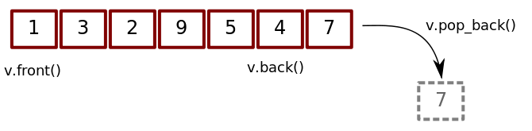
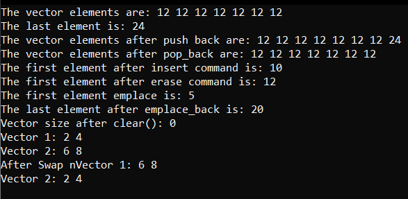
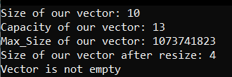
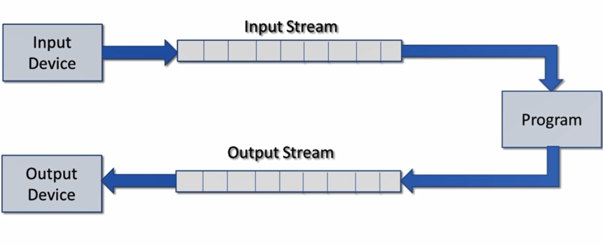
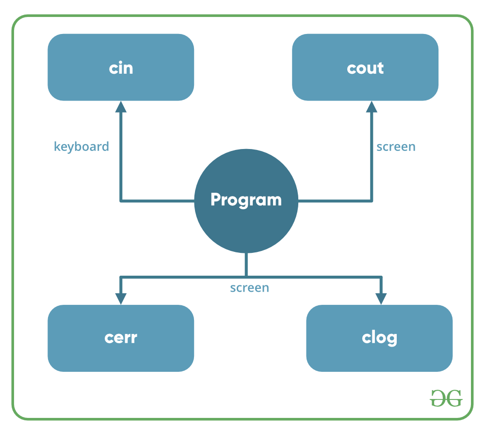
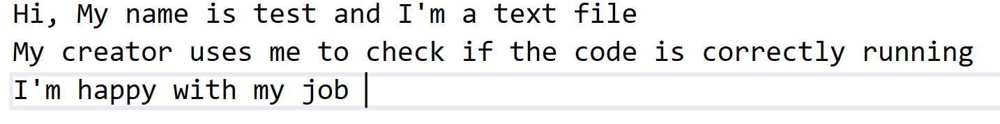

## Tabel Of Content

* [Arrays](arrays)
* [Vectors](vectors)
* [Streams](streams)
* [Files](files)

# Arrays

Arrays are used to store multiple values in a single variable, instead of declaring separate variables for each value.

To declare an array, define the variable type, specify the name of the array followed by square brackets and specify the number of elements it should store:

**Example:**

```c++
string cars[4];
```

We have now declared a variable that holds an array of four strings. To insert values to it, we can use an array literal - place the values in a comma-separated list, inside curly braces:

**Example:**

```c++
string cars[4] = {"Volvo", "BMW", "Ford", "Mazda"};
```

To create an array of three integers, you could write:

**Example:**

```c++
int myNum[3] = {10, 20, 30};
```

Access the Elements of an Array
You access an array element by referring to the index number.

This statement accesses the value of the first element in cars:

**Example:**

```c++
string cars[4] = {"Volvo", "BMW", "Ford", "Mazda"};
cout << cars[0];
// Outputs Volvo
```

## Change an Array Element

To change the value of a specific element, refer to the index number:

**Example:**

```c++
cars[0] = "Opel";
```

```c++
string cars[4] = {"Volvo", "BMW", "Ford", "Mazda"};
cars[0] = "Opel";
cout << cars[0];
// Now outputs Opel instead of Volvo
```

## C++ Omit Array Size

### Omit Array Size

You don't have to specify the size of the array. But if you don't, it will only be as big as the elements that are inserted into it:

```c++
string cars[] = {"Volvo", "BMW", "Ford"}; // size of array is always 3
```

This is completely fine. However, the problem arise if you want extra space for future elements. Then you have to overwrite the existing values:

```c++
string cars[] = {"Volvo", "BMW", "Ford"}; //car[3]
string cars[] = {"Volvo", "BMW", "Ford", "Mazda", "Tesla"};//car[5]
```

If you specify the size however, the array will reserve the extra space:

```c++
string cars[5] = {"Volvo", "BMW", "Ford"}; // size of array is 5, even though it's only three elements inside it
```

Now you can add a fourth and fifth element without overwriting the others:

```c++
cars[3] = {"Mazda"};
cars[4] = {"Tesla"};
```

### Omit Elements on Declaration

It is also possible to declare an array without specifying the elements on declaration, and add them later:

```c++
string cars[5];
cars[0] = {"Volvo"};
cars[1] = {"BMW"};
...
```

## Multidimensional Arrays

In C/C++, we can define multidimensional arrays in simple words as array of arrays. Data in multidimensional arrays are stored in tabular form (in row major order).

General form of declaring N-dimensional arrays:

```c++
data_type  array_name[size1][size2]....[sizeN];
```

>**data_type:** Type of data to be stored in the array.
>
>**array_name:** Name of the array
>
>**size1, size2,... ,sizeN:** Sizes of the dimensions

**Examples:**

Two dimensional array:

```c++
int two_d[10][20];
```

Three dimensional array:

```c++
int three_d[10][20][30];
```

## Size of multidimensional arrays

Total number of elements that can be stored in a multidimensional array can be calculated by multiplying the size of all the dimensions.

**Example:**

```c++
int x[10][20] //can store total (10*20) = 200 elements.
int x[5][10][20] //can store total (5*10*20) = 1000 elements.
```

## Two-Dimensional Array

Two – dimensional array is the simplest form of a multidimensional array. We can see a two – dimensional array as an array of one – dimensional array for easier understanding.

* The basic form of declaring a two-dimensional array of size x, y:

### Syntax

```c++
data_type array_name[x][y];
```

>**data_type:** Type of data to be stored.

* We can declare a two dimensional integer array say ‘x’ of size 10,20 as:

```c++
int x[10][20];
```

* Elements in two-dimensional arrays are commonly referred by **x[i][j]** where i is the row number and ‘j’ is the column number.

* A two – dimensional array can be seen as a table with ‘i’ rows and ‘j’ columns where the row number ranges from 0 to (i-1) and column number ranges from 0 to (j-1). A two – dimensional array ‘x’ with 3 rows and 3 columns is shown below:


**Initializing Two – Dimensional Arrays:** There are two ways in which a Two-Dimensional array can be initialized.

### **First Method:**

```c++
int x[3][4] = {0, 1 ,2 ,3 ,4 , 5 , 6 , 7 , 8 , 9 , 10 , 11}
//0 1 2 3 in first row
//4 5 6 7 in second row
//8 9 10 11 in third row
```

### **Better Method:**

```c++
int x[3][4] = {{0,1,2,3}, {4,5,6,7}, {8,9,10,11}};
```

>This type of initialization make use of nested braces. Each set of inner braces represents one row. In the above example there are total three rows so there are three sets of inner braces.

**Accessing Elements of Two-Dimensional Arrays:** Elements in Two-Dimensional arrays are accessed using the row indexes and column indexes.

### **Example:**

```c++
int x[2][1];
```

>The above example represents the element present in third row and second column.
>
>**Note:** In arrays if size of array is N. Its index will be from 0 to N-1. Therefore, for row index 2 row number is 2+1 = 3.

To output all the elements of a Two-Dimensional array we can use nested **for** loops. We will require two **for** loops. One to traverse the rows and another to traverse columns.

```c++
// C++ Program to print the elements of a 
// Two-Dimensional array 
#include<iostream> 
using namespace std; 
  
int main() 
{ 
    // an array with 3 rows and 2 columns. 
    int x[3][2] = {{0,1}, {2,3}, {4,5}}; 
  
    // output each array element's value 
    for (int i = 0; i < 3; i++) 
    { 
        for (int j = 0; j < 2; j++) 
        { 
            cout << "Element at x[" << i 
                 << "][" << j << "]: "; 
            cout << x[i][j]<<endl; 
        } 
    } 
  
    return 0; 
} 
/*Output:
Element at x[0][0]: 0
Element at x[0][1]: 1
Element at x[1][0]: 2
Element at x[1][1]: 3
Element at x[2][0]: 4
Element at x[2][1]: 5
*/
```

## Three-Dimensional Array

**Initializing Three-Dimensional Array:** Initialization in Three-Dimensional array is same as that of Two-dimensional arrays. The difference is as the number of dimension increases so the number of nested braces will also increase.

**Method 1:**

```c++
int x[2][3][4] = {0, 1, 2, 3, 4, 5, 6, 7, 8, 9, 10, 
                 11, 12, 13, 14, 15, 16, 17, 18, 19,
                 20, 21, 22, 23};
                 
```

**Better Method:**

```c++
int x[2][3][4] = 
 { 
   { {0,1,2,3}, {4,5,6,7}, {8,9,10,11} },
   { {12,13,14,15}, {16,17,18,19}, {20,21,22,23} }
 };
 ```

**Accessing elements in Three-Dimensional Arrays:** Accessing elements in Three-Dimensional Arrays is also similar to that of Two-Dimensional Arrays. The difference is we have to use three loops instead of two loops for one additional dimension in Three-dimensional Arrays.

```c++
// C++ program to print elements of Three-Dimensional 
// Array 
#include<iostream> 
using namespace std; 
  
int main() 
{ 
    // initializing the 3-dimensional array 
    int x[2][3][2] = 
    { 
        { {0,1}, {2,3}, {4,5} }, 
        { {6,7}, {8,9}, {10,11} } 
    }; 
  
    // output each element's value 
    for (int i = 0; i < 2; ++i) 
    { 
        for (int j = 0; j < 3; ++j) 
        { 
            for (int k = 0; k < 2; ++k) 
            { 
                cout << "Element at x[" << i << "][" << j 
                     << "][" << k << "] = " << x[i][j][k] 
                     << endl; 
            } 
        } 
    } 
    return 0; 
} 
/*
Output:

Element at x[0][0][0] = 0
Element at x[0][0][1] = 1
Element at x[0][1][0] = 2
Element at x[0][1][1] = 3
Element at x[0][2][0] = 4
Element at x[0][2][1] = 5
Element at x[1][0][0] = 6
Element at x[1][0][1] = 7
Element at x[1][1][0] = 8
Element at x[1][1][1] = 9
Element at x[1][2][0] = 10
Element at x[1][2][1] = 11
*/
```

In similar ways, we can create arrays with any number of dimension. However the complexity also increases as the number of dimension increases.
The most used multidimensional array is the Two-Dimensional Array.

# Vectors

Vectors in C++ are sequence containers representing arrays that can change in size. They use contiguous storage locations for their elements, which means that their elements can also be accessed using offsets on regular pointers to its elements, and just as efficiently as in arrays. Following Pointers will be covered in this article:

* What is Vector in C++?
  * Is vector ordered in C++?
  * How are vectors stored in C++?
* Member functions of Vectors
  * Modifiers
  * Iterators
  * Capacity

## What is Vector ?

Vectors in C++ are the dynamic arrays that are used to store data. Unlike arrays, which are used to store sequential data and are static in nature, Vectors provide more flexibility to the program. Vectors can resize itself automatically when an element is inserted or deleted depending on the need of the task to be executed. It is not the same in an array where only a given number of values can be stored under a single variable name.



### Is vector ordered ?

No vectors are not ordered in C++. Vector elements are placed in adjacent storage so that they can be accessed and travel across using iterators. In vectors, data is inserted at the end of it. Inserting an element at the end takes differential time, as sometimes there may be a need of extending the vector. Removing the last element takes only constant time because no resizing occurs. Inserting and erasing at the beginning or in the middle of the vector is linear in time.

### How are vectors stored ?

To create a vector, you need to follow the below given syntax.

**Syntax:**

```c++
vector< object_type > variable_name;
```

**Example:**

```c++
#include <vector>
int main()
{
    std::vector<int> my_vector;
}
```

In the above example, a blank vector is being created. Vector is a dynamic array and, doesn’t needs size declaration.

## Member Functions of Vectors

A Vector container in STL provides us with various useful functions.

1. Modifiers
2. Iterators
3. Capacity

### **Modifiers**

1. **push_back():** The function pushes the elements into a vector from the back. If the type of object passed as a parameter in the push_back() is not same as that of the vector an exception is thrown.

2. **assign():** It assigns a new value to the vector elements by replacing old ones.

3. **pop_back():** The pop_back() function is used to pop or remove elements from a vector from the back. It reduces the size of the vector by one element.

4. **insert():** This function inserts new elements before the element before the position pointed by the iterator. We can also pass a third argument count, that counts the number of times the element is to be inserted before the pointed position.

5. **erase():** erase() function is used to remove elements from a container from the specified position or range. We can either pass the position of the specific elements needs need to remove or we can pass the starting point and endpoint of a range of elements.

6. **swap():** swap() function is used to swap the contents of one vector with another vector of the same type. Sizes may differ.

7. **clear():** clear() function is used to remove all the elements of the vector container.

### **Iterators**

1. **begin():** This function returns an iterator pointing to the first element in the vector.

2. **end():** The end() function returns an iterator pointing to the last element in the vector.

**Example:**

```c++
// Modifiers in vector 
#include <iostream> 
#include <vector> 
using namespace std;

int main()
{
    // Assign vector 
    vector<int> vec;

    // fill the array with 12 seven times 
    vec.assign(7, 12);

    cout << "The vector elements are: ";
    for (int i = 0; i < 7; i++)
        cout << vec[i] << " ";
    cout << endl;
    // inserts 24 to the last position 
    vec.push_back(24);
    int s = vec.size();
    cout << "The last element is: " << vec[s - 1];
    cout << endl;
    // prints the vector 
    cout << "The vector elements after push back are: ";
    for (int i = 0; i < vec.size(); i++)
        cout << vec[i] << " ";
    cout << endl;
    // removes last element 
    vec.pop_back();

    // prints the vector 
    cout << "The vector elements after pop_back are: ";
    for (int i = 0; i < vec.size(); i++)
        cout << vec[i] << " ";
    cout << endl;
    // inserts 10 at the beginning 
    vec.insert(vec.begin(), 10);

    cout << "The first element after insert command is: " << vec[0];
    cout << endl;
    // removes the first element 
    vec.erase(vec.begin());

    cout << "The first element after erase command is: " << vec[0];
    cout << endl;
    // inserts at the beginning 
    vec.emplace(vec.begin(), 5);
    cout << "The first element emplace is: " << vec[0];
    cout << endl;
    // Inserts 20 at the end 
    vec.emplace_back(20);
    s = vec.size();
    cout << "The last element after emplace_back is: " << vec[s - 1];
    cout << endl;
    // erases the vector 
    vec.clear();
    cout << "Vector size after clear(): " << vec.size();
    cout << endl;
    // two vector to perform swap 
    vector<int> obj1, obj2;
    obj1.push_back(2);
    obj1.push_back(4);
    obj2.push_back(6);
    obj2.push_back(8);

    cout << "Vector 1: ";
    for (int i = 0; i < obj1.size(); i++)
        cout << obj1[i] << " ";
    cout << endl;
    cout << "Vector 2: ";
    for (int i = 0; i < obj2.size(); i++)
        cout << obj2[i] << " ";
    cout << endl;
    // Swaps obj1 and obj2 
    obj1.swap(obj2);

    cout << "After Swap nVector 1: ";
    for (int i = 0; i < obj1.size(); i++)
        cout << obj1[i] << " ";
    cout << endl;
    cout << "Vector 2: ";
    for (int i = 0; i < obj2.size(); i++)
        cout << obj2[i] << " ";
    cout << endl;
}
```



### **Capacity**

1. **size():** This function returns the number of elements in the vector.

2. **max_size():** The max_size() function returns the maximum number of elements that the vector can hold.

3. **capacity():** The capacity() function returns the size of the storage space currently allocated to the vector expressed as number of elements based on the memory allocated to the vector.

4. **resize():** This function resizes the container so that it contains ‘n’ elements. If the current size of the vector is greater than n then the back elements are removed from the vector and id the current size is smaller than n then extra elements are inserted at the back of the vector.

5. **empty():** Returns whether the container is empty, it return true if vector is empty else returns false.

**Example:**

```c++
#include <iostream> 
#include <vector> 
   
using namespace std; 
   
int main() 
{ 
    vector<int> vec1; 
   
    for (int i = 1; i <= 10; i++) 
        vec1.push_back(i); 
   
    cout << "Size of our vector: " << vec1.size(); 
    cout << "\nCapacity of our vector: " << vec1.capacity(); 
    cout << "\nMax_Size of our vector: " << vec1.max_size(); 
   
    // resizes the vector size to 4 
    vec1.resize(4); 
   
    // prints the vector size after resize() 
    cout << "\nSize of our vector after resize: " << vec1.size(); 
   
    // checks if the vector is empty or not 
    if (vec1.empty() == false) 
        cout << "\nVector is not empty"; 
    else
        cout << "\nVector is empty"; 
   
    return 0; 
}
```



# Streams

## Basic Input / Output in C++

C++ comes with libraries that provide us with many ways for performing input and output. In C++ input and output are performed in the form of a sequence of bytes or more commonly known as **streams**.

* **Input Stream:(`istream`)** If the direction of flow of bytes is from the device(for example, Keyboard) to the main memory then this process is called input.

* **Output Stream:(`ostream`)** If the direction of flow of bytes is opposite, i.e. from main memory to device( display screen ) then this process is called output.

* **`iostream`:** derived from `istream` and `ostream`,that can do both Input/Output.



After we included **iostream** liberary the combilar will understand that we will use I/O devices and there will be a stream of data from and to this devices , but we need to translate those sequences of bytes in order to simplify sending and receiving data operations .So, we use **std namespace**

## standerd namespace (std)

namespaces are containers for identifiers.

standard namespace contains the identifiers used with `iostream` library in order to transfer data (e.g.cout,cin,cerr,clog...) and many other identifiers(e.g.string,vector, endl...).



### Why “using namespace std” is considered bad practice ?

The statement `using namespace std;` is generally considered bad practice. The alternative to this statement is to specify the namespace to which the identifier belongs using the scope operator(`::`) each time we declare a type.
Although the statement saves us from typing `std::` whenever we wish to access a class or type defined in the std namespace, it imports the entirety of the std namespace into the current namespace of the program. Let us take a few examples to understand why this might not be such a good thing
Let us say we wish to use the cout from the std namespace. So we write

**Example 1:**

```c++
#include <iostream>
using namespace std;
int main(){
    cout << " Something to Display";
 }
 ```

 Now at a later stage of development, we wish to use another version of cout that is custom implemented in some library called “foo” (for example)

```c++
#include <foo.h>
#include <iostream>
using namespace std;
int main(){
    cout << " Something to display";
 }
```

Notice how there is an ambiguity, to which library does cout point to? The compiler may detect this and not compile the program. In the worst case, the program may still compile but call the wrong function, since we never specified to which namespace the identifier belonged.
Namespaces were introduced into C++ to resolve identifier name conflicts. This ensured that two objects can have the same name and yet be treated differently if they belonged to different namespaces. Notice how the exact opposite has occurred in this example. Instead of resolving a name conflict, we actually create a naming conflict.

When we import a namespace we are essentially pulling all type definitions into the current scope. The std namespace is huge. It has hundreds of predefined identifiers, so it is possible that a developer may overlook the fact there is another definition of their intended object in the std library. Unaware of this they may proceed to specify their own implementation and expect it to be used in later parts of the program. Thus there would exist two definitions for the same type in the current namespace. This is not allowed in C++, and even if the program compiles there is no way of knowing which definition is being used where.

The solution to the problem is to explicitly specify to which namespace our identifier belongs to using the scope operator (`::`). Thus one possible solution to the above example can be

```c++
#include <foo>
#include <iostream>
int main(){ 
// Use cout of std library
std::cout << "Something to display";
 
// Use cout of foo library
foo::cout < "Something to display";
}
```

# Files

The `fstream` library allows us to work with files.
it is derived from 2 libraries: `ifstream` and `ofstream`.

* `ifstream` : to read from a file.

* `ofstream` : Creates and writes to files.

## Read from a text File

to read from a file we do the following :

* **include `iostream` and `fstream` libraries:**

```c++
#include<iostream>
#include<fstream>
```

* **define an object from `fstream` or `ifstream` class  like :**

```c++
std::ifstream MyReadFile {"filename.txt"}
//if the text file is not in the project folder you should write the full address like:{"C:\\Users\\desktop\\source\\repos\\test1111\\filename.txt"}
```

or

```c++
std::fstream MyReadFile {"filename.txt"}
```

>Notes about fstream object:
>
>* It can be used as a bool to check if the file is opened : `if (MyReadFile){...}`
>* It has many useful methods like:
>* In_file.eof()  : check if the program reached the end of file (bool)
>* In_file.open() : open the file
>
>   note that when you give the object an address the file will automatically open
>* In_file.close() : close the file
>* In_file.get(char) : read a char from the file
>* In_file.put(char) : write a char to the file

* **Read data from the file**
  * `>>` operator
  * get() method
  * getline function

we will learn how to use them soon

* **close the file**

It is considered good practice, and it can clean up unnecessary memory space.

consider a text file named test with the following content:


**Example1:** using `>>` operator

```c++
//Reading from a text file 
//First we must include iostream and fstream library
#include<iostream>
#include<fstream>
int main() {
//Second we declare an object from fstream class
std::ifstream in_file{ "test.txt" };
std::string line{};
if (!in_file) {            //check if the file is opened or not
std::cout << "error\n";
return 1;
}
// we will use ">>" operator to read data and store it in string named line
in_file >> line;
//then we will print the line string on consule
std::cout << line << std::endl;
in_file.close();
return 0;
}
/*  the Output:
    Hi,
*/
```

>the `>>` operator act as `cin` when the user enters a whole text the string will store every thing before space " " or the end of the line

**Example2:** using `getline` function

in order to use this function you should include `string` library

getline function take the whole line and store it in the string

```c++
//Reading from a text file 
#include<iostream>
#include<fstream>
#include<string>
int main() {
std::ifstream in_file{ "test.txt" };
std::string line{};
if (!in_file) {            //check if the file is opened or not
std::cout << "error\n";
return 1;
}
std::getline(in_file, line); 
//the whole line will be stored stored  in line string
std::cout << line << std::endl;
in_file.close();
return 0;
}
/*  Output:
    Hi, My name is test and I'm a text file
*/
```

we can make a loop to print the whole text like this :

```c++
//Reading from a text file 
#include<iostream>
#include<fstream>
#include<string>
int main() {
std::ifstream in_file{ "test.txt" };
std::string line{};
if (!in_file) {            //check if the file is opened or not
std::cout << "error\n";
return 1;
}
while (std::getline(in_file, line)) { 
//this means if there is a data that can be stored then enter the loop
std::cout << line << std::endl;
}
in_file.close();
return 0;
}
/*  Output :
    Hi, My name is test and I'm a text file
    My creator uses me to check if the code is correctly running
    I'm happy with my job
*/
```

or like this :

```c++
//Reading from a text file 
#include<iostream>
#include<fstream>
#include<string>
int main() {
std::ifstream in_file{ "test.txt" };
std::string line{};
if (!in_file) {            //check if the file is opened or not
std::cout << "error\n";
return 1;
}
while (!in_file.eof()) {  
 //this means if it's not end of file then enter the loop
std::getline(in_file, line);
std::cout << line << std::endl;
}
in_file.close();
return 0;
}
/*  Output :
    Hi, My name is test and I'm a text file
    My creator uses me to check if the code is correctly running
    I'm happy with my job
*/
```

**Example3:** using get() method

```c++
//Reading from a text file 
#include<iostream>
#include<fstream>
#include<string>
int main() {
std::ifstream in_file{ "test.txt" };
char c{};
if (!in_file) {            //check if the file is opened or not
std::cout << "error\n";
return 1;
}
while (!in_file.eof()) {  
 //this means if it's not end of file then enter the loop
in_file.get(c); //will get char and store it in c
std::cout << c;
}
in_file.close();
return 0;
}
/*  Output :
    Hi, My name is test and I'm a text file
    My creator uses me to check if the code is correctly running
    I'm happy with my job
*/
```

## Writing on a file

we write on a file using `<<` Operator, with the same steps as reading

* **include `iostream` and `fstream` libraries:**
* **define an object from `ofstream` or `fstream` class  like :**

```c++
std::ofstream out_file{ "test.txt"};
```

or

```c++
std::fstream out_file{ "test.txt",std::ios::out};
```

* **Write any thing in the file using `<<` operator**
* **close the file**

>Note that:
>
>* Output files will be created if they don’t exist, but sometimes antiviruses prevent that .So, it's better to creat one by yourself
>
>* Output files will be overwritten (truncated) by default
>
>* Output files can be opened so that new writes append

**Example1:**  

consider the text file we used for reading


**If we want the program to overwrite the file:**

```c++
//Writing on a text file 
#include<iostream>
#include<fstream>
#include<string>
int main() {
std::ofstream out_file{ "test.txt"};
//std::fstream out_file{"test.txt",std::ios::out} will do the same
if (!out_file) {            //check if the file is opened or not
std::cout << "error\n";
return 1;
}
out_file << "OOPS, i lost my memory\n";
out_file.close();
return 0;
}
/*  Output:
    OOPS, i lost my memory
*/
```

**If we want the program to keep the data:**

```c++
//Writing on a text file 
#include<iostream>
#include<fstream>
#include<string>
int main() {
std::ofstream out_file{ "test.txt",std::ios::app};
/*
std::fstream out_file{"test.txt",std::ios::out|std::ios::app}
 will do the same
*/
if (!out_file) {            //check if the file is opened or not
std::cout << "error\n";
return 1;
}
out_file << "Yummy fresh data\n";
out_file.close();
return 0;
}
/*  Output:
    OOPS, i lost my memory
    Yummy fresh data
*/
```

>**Note:**
>
>we can use put() method too
>
>try it by yourself
